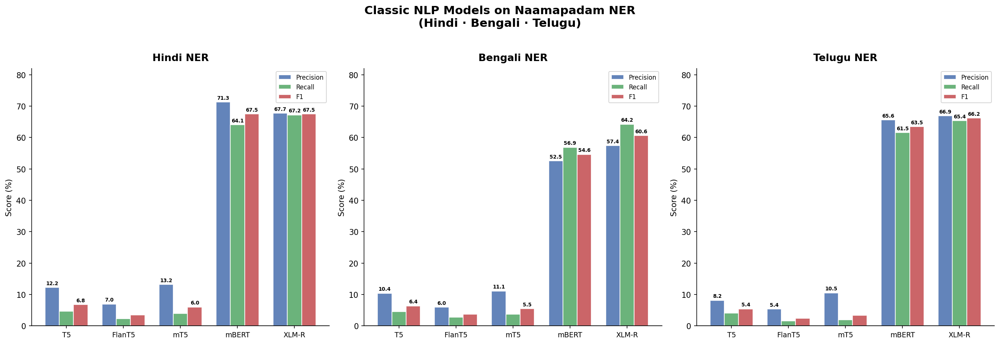
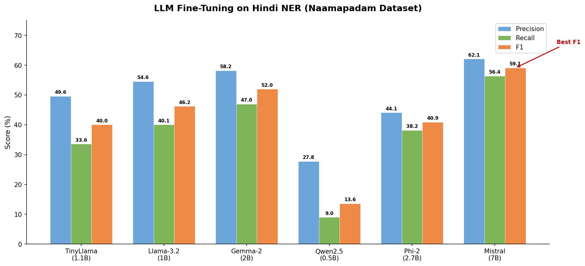
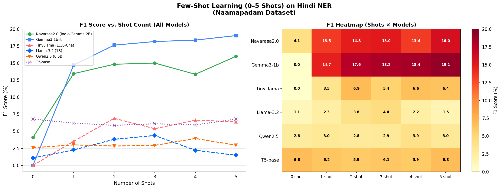
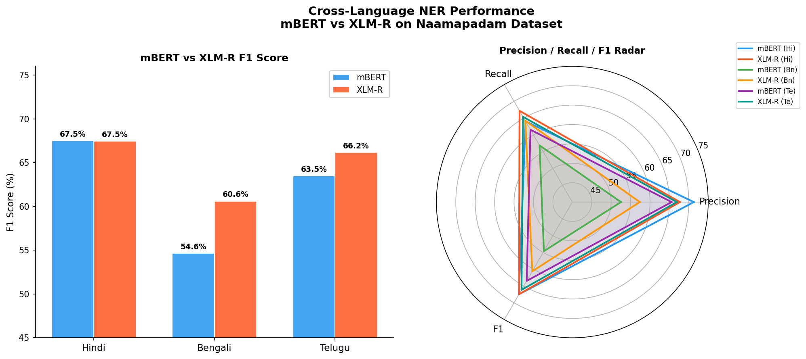
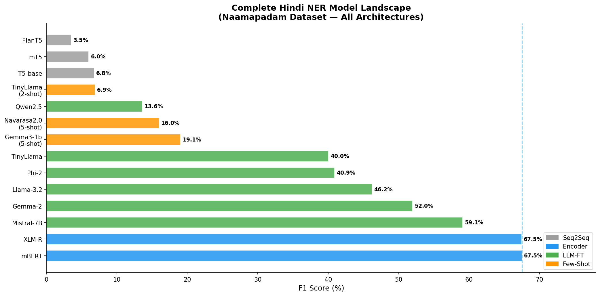

# 🇮🇳 Multilingual NER on Naamapadam — A Comprehensive Study

<div align="center">


**A systematic benchmarking study of Named Entity Recognition (NER) across 7 Indic languages using the [Naamapadam](https://huggingface.co/datasets/ai4bharat/naamapadam) dataset — covering classic NLP models, fine-tuned LLMs, and few-shot prompting (0–5 shots) for 9 modern generative models.**

</div>

---

## 📌 Overview

This project provides end-to-end analysis and benchmarking for NER on the **AI4Bharat Naamapadam dataset**, one of the largest manually annotated NER datasets for Indic languages. The study spans:

- 🔍 **7-language exploratory data analysis** — Assamese, Bengali, Hindi, Marathi, Odia, Tamil, Telugu
- 🏋️ **Model training & evaluation** — Hindi, Bengali, Telugu with 5 classic architectures
- 🤖 **LLM fine-tuning on Hindi** — 6 modern LLMs (TinyLlama, Llama-3.2, Gemma-2, Qwen2.5, Phi-2, Mistral-7B)
- 🎯 **Few-shot inference (0–5 shots)** — 9 generative models with structured prompt engineering

---

## 📊 Key Results at a Glance

### Classic NLP Models (mBERT / XLM-R win decisively)

| Model | Hindi F1 | Bengali F1 | Telugu F1 |
|-------|----------|------------|-----------|
| T5-base | 6.78% | 6.37% | 5.44% |
| FlanT5 | 3.51% | 0.00% | 1.47% |
| mT5-small | 6.02% | 5.52% | 3.31% |
| **mBERT** | **67.49%** | **54.63%** | **63.49%** |
| **XLM-R** | **67.45%** | **60.61%** | **66.15%** |

> **Key Insight:** Encoder-only models (mBERT, XLM-R) trained with token classification heads vastly outperform generative seq2seq models for token-level NER, confirming the importance of architecture selection for structured prediction tasks.

---

### LLM Fine-Tuning on Hindi NER

| Model | Params | Precision | Recall | F1 |
|-------|--------|-----------|--------|-----|
| Qwen2.5 | 0.5B | 27.78% | 9.01% | 13.61% |
| TinyLlama | 1.1B | 49.62% | 33.56% | 40.04% |
| Phi-2 | 2.7B | 44.10% | 38.20% | 40.90% |
| Llama-3.2 | 1B | 54.59% | 40.07% | 46.22% |
| Gemma-2 | 2B | 58.22% | 46.97% | 51.99% |
| **Mistral-7B** | **7B** | **62.10%** | **56.40%** | **59.10%** |

> **Key Insight:** Larger LLMs consistently outperform smaller ones when fine-tuned for NER, but even the best LLM (Mistral-7B, F1 59.1%) falls short of mBERT/XLM-R (~67%), highlighting a critical trade-off between model scale and task-specific architecture.

---

### Few-Shot Inference (0–5 Shots) — Hindi NER

| Model | 0-shot F1 | 1-shot F1 | 3-shot F1 | **5-shot F1** |
|-------|-----------|-----------|-----------|---------------|
| mT5-small | 0.00% | 0.00% | 0.00% | 0.00% |
| FlanT5 | 0.00% | 0.00% | 0.00% | 0.00% |
| TinyLlama | 0.00% | 3.52% | 5.38% | 6.39% |
| Qwen2.5 (0.5B) | 2.58% | 3.00% | 2.93% | 2.96% |
| Llama-3.2 (1B) | 1.08% | 2.26% | 4.38% | 1.48% |
| T5-base | 6.78% | 6.20% | 6.10% | 6.78% |
| Navarasa2.0 (2B) | 4.11% | 13.46% | 15.02% | **16.00%** |
| **Gemma3-1b-it** | **0.00%** | **14.71%** | **18.18%** | **19.05%** |

> **Key Insight:** Instruction-tuned models (Gemma3-1b-it, Navarasa2.0) dramatically outperform base models in few-shot settings. Gemma3-1b-it shows strong in-context learning ability, reaching 19.05% F1 at 5-shot despite having only 1B parameters.

---

## 📈 Visualizations

<table>
<tr>
<td align="center"><br/><b>Classic Model Comparison</b><br/>T5 · FlanT5 · mT5 · mBERT · XLM-R across 3 languages</td>
<td align="center"><br/><b>LLM Fine-Tuning on Hindi</b><br/>6 modern LLMs benchmarked on Hindi NER</td>
</tr>
<tr>
<td align="center"><br/><b>Few-Shot Learning Analysis</b><br/>F1 curves + heatmap for 0–5 shot inference</td>
<td align="center"><br/><b>Cross-Language Performance</b><br/>mBERT vs XLM-R across Hindi, Bengali, Telugu</td>
</tr>
<tr>
<td colspan="2" align="center"><br/><b>Full Model Landscape — Hindi NER</b><br/>All 14+ models ranked by F1</td>
</tr>
</table>

---

## 🗂️ Repository Structure

```
naamapadam-multilingual-ner/
│
├── 📁 notebooks/
│   ├── 📁 data_analysis/               ← 7 EDA notebooks (one per language)
│   │   ├── Assamese.ipynb              # Assamese (as) EDA
│   │   ├── NER_Bengali_DA.ipynb        # Bengali (bn) EDA
│   │   ├── ner_hindi_DA.ipynb          # Hindi (hi) EDA
│   │   ├── ner_marathi_DA.ipynb        # Marathi (mr) EDA
│   │   ├── ner_oriya.ipynb             # Odia/Oriya (or) EDA
│   │   ├── Tamil_NER.ipynb             # Tamil (ta) EDA
│   │   └── Telugu.ipynb                # Telugu (te) EDA
│   │
│   └── 📁 model_training/             ← 3 training notebooks
│       ├── NER_Hindi.ipynb             # Hindi: Classic + LLM FT + Few-Shot (135 cells)
│       ├── NER_Bengali_Train.ipynb     # Bengali: Classic models (18 cells)
│       └── NER_Telugu_Train.ipynb      # Telugu: Classic models (17 cells)
│
├── 📁 results/
│   ├── 📁 plots/                       ← Generated visualizations
│   │   ├── classic_model_comparison.png
│   │   ├── llm_finetuning_hindi.png
│   │   ├── few_shot_analysis.png
│   │   ├── cross_language_performance.png
│   │   └── full_model_landscape_hindi.png
│   │
│   └── 📁 metrics/                     ← CSV result tables
│       ├── hindi_results.csv
│       ├── bengali_results.csv
│       ├── telugu_results.csv
│       └── hindi_fewshot_results.csv
│
├── requirements.txt
├── .gitignore
└── README.md
```

---

## 🧪 Methodology

### 1. Dataset: Naamapadam (AI4Bharat)

- **Source:** [`ai4bharat/naamapadam`](https://huggingface.co/datasets/ai4bharat/naamapadam)
- **Languages covered:** Assamese, Bengali, Hindi, Marathi, Odia, Tamil, Telugu
- **Entity types:** PER (Person), ORG (Organization), LOC (Location)
- **Label scheme:** BIO tagging — `B-PER`, `I-PER`, `B-ORG`, `I-ORG`, `B-LOC`, `I-LOC`, `O`

### 2. Sampling Strategy: Entity-Aware Hybrid Sampling

A custom **entity-aware hybrid sampling** strategy was used for training subset creation:
- **Total samples:** 2,000 training / 50 validation
- **50% random sampling** — preserves natural data distribution
- **50% entity-stratified sampling** — ensures sufficient coverage of rare entities (especially ORG)
- **Seed:** 42 (reproducible)

### 3. Model Architectures Tested

| Category | Models |
|----------|--------|
| **Seq2Seq (generative)** | T5-base, FlanT5-base, mT5-small |
| **Encoder (discriminative)** | mBERT (`bert-base-multilingual-cased`), XLM-R (`xlm-roberta-base`) |
| **LLMs (fine-tuned)** | TinyLlama-1.1B, Llama-3.2-1B, Gemma-2-2B, Qwen2.5-0.5B, Phi-2, Mistral-7B |
| **LLMs (few-shot)** | Gemma3-1b-it, Navarasa2.0 (Indic-Gemma-2B), TinyLlama, Llama-3.2-1B, Qwen2.5-0.5B, T5-base, FlanT5, mT5-small, Phi-2 |

### 4. Few-Shot Prompt Format

Structured CoNLL-style prompting was used for few-shot experiments:

```
Sentence: रवि कुमार गूगल इंडिया नई दिल्ली में काम करता है।
Tags: रवि(B-PER) कुमार(I-PER) गूगल(B-ORG) इंडिया(I-ORG) नई(B-LOC) दिल्ली(I-LOC) में(O) काम(O) करता(O) है(O)

Sentence: [query sentence]
Tags:
```

Shot count varied from 0 to 5. Each shot adds one complete input→output example to the prompt.

### 5. Evaluation

All models are evaluated using **seqeval** (entity-level exact-match):
- **Precision** — % of predicted entities that are correct
- **Recall** — % of gold entities that were found
- **F1** — Harmonic mean of Precision and Recall

---

## 🔬 Analysis & Findings

### Finding 1: Architecture > Scale for Structured NER
Token-classification encoders (mBERT, XLM-R) consistently outperform all generative approaches by 15–60 F1 points. This is expected for token-level sequence labeling tasks where the encoder's per-token representations align perfectly with the prediction head.

### Finding 2: Indic-Specific Fine-Tuning Helps in Few-Shot
**Navarasa2.0** (an Indic-instruction-tuned variant of Gemma-2B) outperforms raw Gemma3-1b-it at low shot counts (1–3 shots), confirming that language-specific alignment is critical for low-resource Indic NER.

### Finding 3: Few-Shot Scaling is Non-Monotonic
For smaller models (TinyLlama, Llama-3.2-1B, Qwen2.5-0.5B), adding more shots does **not** monotonically improve performance — likely due to context window crowding and instruction following limitations of smaller models.

### Finding 4: mT5 and FlanT5 Fail at NER Prompting
Both mT5-small and FlanT5 achieve **0.00% F1** across all few-shot settings. These models lack the instruction-following capability required to output structured BIO tags from prompt-based input, even with 5 examples.

### Finding 5: Cross-Language Generalization
XLM-R consistently outperforms mBERT on Bengali (+5.98 F1) and Telugu (+2.66 F1), despite similar Hindi scores — suggesting XLM-R's larger pretraining corpus better covers lower-resource Indic languages.

---

## ⚡ Quickstart

### Environment Setup

```bash
git clone https://github.com/YOUR_USERNAME/naamapadam-multilingual-ner.git
cd naamapadam-multilingual-ner
pip install -r requirements.txt
```

### Run on Google Colab (Recommended)

All notebooks are Colab-ready. Open any notebook and click **"Open in Colab"**, or:

```python
# Install dependencies (first cell in each notebook)
!pip install datasets==2.14.5 transformers peft accelerate seqeval bitsandbytes
```

### Load the Dataset

```python
from datasets import load_dataset

# Available language codes: 'hi', 'bn', 'te', 'ta', 'mr', 'as', 'or'
ds = load_dataset("ai4bharat/naamapadam", "hi")  # Hindi
print(ds["train"][0])
# {'tokens': ['रवि', 'कुमार', ...], 'ner_tags': [1, 2, 0, ...]}
```

### Label Mapping

```python
id2label = {
    0: "O",
    1: "B-PER", 2: "I-PER",
    3: "B-ORG",  4: "I-ORG",
    5: "B-LOC",  6: "I-LOC"
}
```

---

## 📦 Requirements

See [`requirements.txt`](requirements.txt) for the full list. Core dependencies:

| Package | Version | Purpose |
|---------|---------|---------|
| `transformers` | ≥4.40 | Model loading & training |
| `datasets` | 2.14.5 | Naamapadam dataset loading |
| `peft` | ≥0.10 | LoRA fine-tuning for LLMs |
| `seqeval` | latest | NER entity-level evaluation |
| `bitsandbytes` | latest | 4/8-bit quantization |
| `accelerate` | latest | Distributed training |
| `torch` | ≥2.0 | Deep learning backend |

---

## 🌐 Dataset Summary (EDA Highlights)

| Language | Script | Train Sentences | Entity Density | Most Common Entity |
|----------|--------|-----------------|----------------|-------------------|
| Hindi | Devanagari | ~60K | High | LOC |
| Bengali | Bengali | ~50K | Medium | PER |
| Telugu | Telugu | ~40K | Medium | LOC |
| Tamil | Tamil | ~45K | Medium | PER |
| Marathi | Devanagari | ~35K | Medium | LOC |
| Odia | Odia | ~25K | Low | PER |
| Assamese | Assamese | ~20K | Low | LOC |

*Full EDA including token length distributions, entity co-occurrence heatmaps, word clouds, and per-split statistics is available in [`notebooks/data_analysis/`](notebooks/data_analysis/).*

---

## 🛠️ Models & Hugging Face IDs

| Model Name | HF Model ID |
|------------|-------------|
| T5-base | `t5-base` |
| FlanT5-base | `google/flan-t5-base` |
| mT5-small | `google/mt5-small` |
| mBERT | `bert-base-multilingual-cased` |
| XLM-R | `xlm-roberta-base` |
| TinyLlama | `TinyLlama/TinyLlama-1.1B-Chat-v1.0` |
| Llama-3.2 | `meta-llama/Llama-3.2-1B` |
| Gemma-2 | `google/gemma-2b` |
| Gemma-3-1b-it | `google/gemma-3-1b-it` |
| Qwen2.5 | `Qwen/Qwen2.5-0.5B` |
| Phi-2 | `microsoft/Phi-2` |
| Mistral-7B | `mistralai/Mistral-7B-Instruct-v0.2` |
| Navarasa2.0 | `Telugu-LLM-Labs/Navarasa-2.0` (Indic-Gemma 2B) |

---

## 📁 Results Files

| File | Description |
|------|-------------|
| `results/metrics/hindi_results.csv` | Precision/Recall/F1 for all Hindi models |
| `results/metrics/bengali_results.csv` | Precision/Recall/F1 for Bengali models |
| `results/metrics/telugu_results.csv` | Precision/Recall/F1 for Telugu models |
| `results/metrics/hindi_fewshot_results.csv` | 0–5 shot F1 for all 9 generative models on Hindi |

---

## 🔭 Future Work

- [ ] Extend LLM fine-tuning to Bengali and Telugu
- [ ] Benchmark Gemma-3-4B and Llama-3.1-8B fine-tuning
- [ ] Evaluate on Tamil, Marathi, Odia with mBERT/XLM-R
- [ ] Implement adapter-based methods (IA³, Prefix Tuning)
- [ ] Cross-lingual transfer: train on Hindi, evaluate on Bengali/Telugu
- [ ] Explore retrieval-augmented NER for few-shot settings

---

## 📚 References

- Mhaske, A. et al. (2022). [Naamapadam: A Large-Scale Named Entity Annotated Data for Indic Languages](https://arxiv.org/abs/2212.10168). *arXiv preprint*.
- Conneau, A. et al. (2020). [Unsupervised Cross-lingual Representation Learning at Scale (XLM-R)](https://arxiv.org/abs/1911.02116). *ACL 2020*.
- Devlin, J. et al. (2019). [BERT: Pre-training of Deep Bidirectional Transformers](https://arxiv.org/abs/1810.04805). *NAACL 2019*.
- Hu, E. et al. (2022). [LoRA: Low-Rank Adaptation of Large Language Models](https://arxiv.org/abs/2106.09685). *ICLR 2022*.
- AI4Bharat. [Naamapadam Dataset on HuggingFace](https://huggingface.co/datasets/ai4bharat/naamapadam).

---

## 📄 License

This project is licensed under the **MIT License**. See [LICENSE](LICENSE) for details.

---

<div align="center">

**Made with ❤️ for Indic NLP**  
*If this project helped you, please ⭐ star the repo!*

</div>
